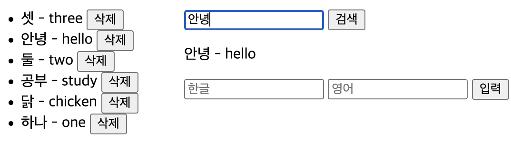

# 해시 테이블을 사용한 단어장



<br>
<br>

## 해시 함수

해시함수로 가장 간단한 제산함수를 사용.

탐색키가 문자열이므로

각 문자의 ascii code를 모두 더하여 SIZE로 모듈러 연산

( \* 제산함수 : '탐색 key % Table SIZE' 를 해시 주소로 사용 )

```jsx
 hashFn(key) {
   return (
     String(key)
       .split("")
       .reduce((acc, curr) => acc + curr.charCodeAt(), 0) % this.size
   );
 }
```

<br>
<br>

## 오버플로

체이닝으로 오버플로 처리.

( \* 체이닝 : 버킷을 연결 리스트로 구현해 하나의 버킷에 여러개의 자료를 담음 )

( \* 오버플로 : 충돌이 슬롯 수보다 더 많이 발생하는 상황 )

```jsx
insert(key, value) {
    const hash_key = this.hashFn(key);
    let node = this.table[hash_key];
    if (!node) {
      this.table[hash_key] = new Node(Entry(key, value), null);
      return this.renderList();
    }
    while(node) {
      if(String(key) === String(Object.keys(node.entry))) {
        return alert('이미 존재하는 단어');
      }
      node = node.next;
    }
    const new_node = new Node(Entry(key, value), this.table[hash_key].next);
    this.table[hash_key].next = new_node;
    return this.renderList();
  }
```

<br>
<br>

## 탐색 효율

리스트 : 모든 엔트리를 확인해야 함

해시 테이블 : 해시 함수를 거쳐 나온 주소의 연결리스트만 확인

<strong>훨씬 효율적.</strong>

```jsx
search(key) {
    const search_textNode = document.querySelector(".search_value");
    let node = this.table[this.hashFn(key)];
    while (node) {
      if (String(Object.keys(node.entry)) === String(key)) {
        return (search_textNode.textContent = `${key} - ${node.entry[key]}`);
      }
      node = node.next;
    }
    return (search_textNode.textContent = "입력한 단어가 존재하지 않습니다.");
  }
```
